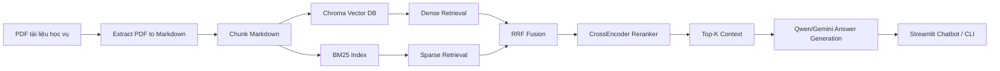

# RAG for Academic Document Search

Hệ thống hỏi đáp học vụ dựa trên RAG cho tài liệu quy chế, quy định và chuẩn đầu ra của Trường Đại học Kinh tế - Kỹ thuật Công nghiệp (UNETI). Dự án chuyển đổi tài liệu PDF sang Markdown, chia văn bản thành các chunk, xây dựng vector database bằng Chroma, sau đó kết hợp dense retrieval, BM25, reciprocal rank fusion và CrossEncoder reranker để tìm ngữ cảnh liên quan trước khi sinh câu trả lời.

Ứng dụng chính là giao diện Streamlit chatbot với hai chế độ:

- `Qwen + Retrieval`: hỏi đáp dựa trên tài liệu đã lập chỉ mục.
- `Qwen only`: hỏi đáp trực tiếp bằng mô hình local, không truy xuất tài liệu.

## Mục tiêu

- Hỗ trợ sinh viên tra cứu nhanh các quy định học vụ từ tài liệu chính thức.
- Giảm hiện tượng mô hình tự bịa bằng cách ràng buộc câu trả lời vào ngữ cảnh truy xuất được.
- Cung cấp pipeline đầy đủ từ PDF thô đến chatbot có nguồn tham chiếu.
- Có script đánh giá retrieval và đánh giá end-to-end bằng RAGAS.

## Tính năng chính

- Trích xuất PDF text bằng Docling.
- Trích xuất PDF scan bằng Gemini Vision, có hỗ trợ xoay nhiều API key khi gặp quota.
- Làm sạch Markdown bằng Gemini tùy chọn.
- Chia chunk Markdown theo kích thước và overlap cấu hình được.
- Xây dựng vector store Chroma với embedding `BAAI/bge-m3`.
- Hybrid retrieval gồm BM25 và dense vector search.
- Hợp nhất thứ hạng bằng Reciprocal Rank Fusion (RRF).
- Rerank kết quả bằng `BAAI/bge-reranker-v2-m3`.
- Sinh câu trả lời bằng Qwen local hoặc Gemini trong CLI/evaluation.
- Giao diện Streamlit hiển thị nguồn tham chiếu cho từng câu trả lời.
- Đánh giá retrieval bằng tập câu hỏi ground truth.
- Đánh giá RAG end-to-end bằng RAGAS.

## Kiến trúc tổng quan



## Cấu trúc thư mục

```text
.
├── app/
│   ├── streamlit_app.py        # Giao diện chatbot
│   ├── prompts.py              # Prompt tiếng Việt cho RAG, Qwen only, query rewrite
│   └── logo/                   # Logo hiển thị trong UI
├── core/
│   ├── config.py               # Đường dẫn, model mặc định, biến môi trường
│   └── gemini.py               # Tiện ích xử lý Gemini API key
├── pipelines/
│   ├── extract/                # PDF -> Markdown
│   ├── chunking/               # Markdown -> JSON chunks
│   ├── vectorstore/            # JSON chunks -> Chroma DB
│   ├── retrieval/              # Đánh giá retrieval
│   ├── chatbot/                # Hybrid retrieval + sinh câu trả lời
│   └── evaluation/             # RAGAS evaluation
├── scripts/
│   ├── run_extract.py          # Chạy trích xuất tài liệu
│   ├── run_chunking.py         # Chạy chia chunk
│   ├── run_vectorize.py        # Xây vector database
│   ├── run_chat_cli.py         # Chatbot trên terminal
│   ├── run_evaluate.py         # Đánh giá retrieval
│   └── run_ragas_evaluate.py   # Đánh giá RAGAS
├── source/
│   ├── pdf/                    # PDF dạng text và Markdown/chunk tương ứng
│   ├── scan/                   # PDF scan và Markdown/chunk tương ứng
│   ├── questions*.json         # Tập câu hỏi đánh giá
│   └── chroma_db/              # Vector DB sinh ra khi chạy, không commit
├── Dockerfile
├── Procfile
├── DEPLOY.md
└── requirements.txt
```

## Công nghệ sử dụng

- Python 3.12
- Streamlit
- LangChain, LangChain Chroma
- ChromaDB
- Sentence Transformers
- Hugging Face Transformers
- Qwen/Qwen2.5-3B-Instruct
- BAAI/bge-m3 embedding
- BAAI/bge-reranker-v2-m3 reranker
- BM25 (`rank-bm25`)
- Docling
- Google Gemini API
- RAGAS
- PyTorch

## Yêu cầu môi trường

Khuyến nghị dùng máy có GPU CUDA, đặc biệt khi chạy Qwen local, embedding và reranker. Một số phần có thể fallback về CPU, nhưng tốc độ sẽ chậm đáng kể. Script `run_vectorize.py` hiện đang yêu cầu GPU theo mặc định.

Cần cài thêm Poppler nếu xử lý PDF scan bằng `pdf2image`.

- Windows: cài Poppler và thêm thư mục `bin` vào `PATH`.
- Linux: `sudo apt-get install poppler-utils`.
- macOS: `brew install poppler`.

## Cài đặt

```bash
git clone https://github.com/luongducthangDS/RAG-for-Academic-Document-Search.git
cd RAG-for-Academic-Document-Search

python -m venv .venv
.venv\Scripts\activate

python -m pip install --upgrade pip
pip install -r requirements.txt
```

Trên macOS/Linux, kích hoạt môi trường ảo bằng:

```bash
source .venv/bin/activate
```

## Cấu hình biến môi trường

Tạo file `.env` từ `.env.example` hoặc export trực tiếp trong terminal:

```env
GEMINI_API_KEY=your_gemini_api_key
GEMINI_API_KEYS=your_gemini_api_key_1,your_gemini_api_key_2
GOOGLE_API_KEY=
GEMINI_MODEL=gemini-2.5-flash
CHROMA_COLLECTION=quy_che_dai_hoc
EMBEDDING_MODEL=BAAI/bge-m3
RERANKER_MODEL=BAAI/bge-reranker-v2-m3
LOCAL_LLM_MODEL=Qwen/Qwen2.5-3B-Instruct
```

Ghi chú:

- `GEMINI_API_KEY` hoặc `GOOGLE_API_KEY` cần cho trích xuất PDF scan, chatbot CLI backend Gemini và RAGAS.
- `GEMINI_API_KEYS` có thể chứa nhiều key phân tách bằng dấu phẩy để pipeline scan/RAGAS xoay key khi hết quota.
- `.env` không được commit lên GitHub.

## Chuẩn bị dữ liệu

Repo đã có sẵn một số PDF, Markdown và JSON chunks mẫu trong `source/pdf`, `source/scan`. Riêng `source/chroma_db` được ignore nên người clone repo cần tự build lại vector database.

### 1. Trích xuất PDF sang Markdown

```bash
python scripts/run_extract.py
```

Các tùy chọn thường dùng:

```bash
python scripts/run_extract.py --overwrite
python scripts/run_extract.py --clean-text-with-ai
python scripts/run_extract.py --api-key YOUR_GEMINI_KEY
```

PDF dạng text được đọc bằng Docling. PDF scan cần Gemini API key vì pipeline chuyển từng trang PDF sang ảnh rồi gọi Gemini Vision để tạo Markdown.

### 2. Chia Markdown thành chunks

```bash
python scripts/run_chunking.py
```

Tùy chỉnh kích thước chunk:

```bash
python scripts/run_chunking.py --chunk-size 800 --chunk-overlap 100
```

Output là các file `*_chunks.json` trong `source/pdf/md` và `source/scan/md`, kèm báo cáo `source/chunk_analysis.json`.

### 3. Xây Chroma vector database

```bash
python scripts/run_vectorize.py
```

Sau khi chạy xong, vector database nằm tại:

```text
source/chroma_db/
```

Thư mục này là artifact runtime, không commit lên GitHub. Nếu muốn thêm dữ liệu mới, hãy đặt PDF vào `source/pdf` hoặc `source/scan`, chạy lại extract, chunking và vectorize.

## Chạy ứng dụng Streamlit

```bash
streamlit run app/streamlit_app.py
```

Mở trình duyệt tại:

```text
http://localhost:8501
```

Trong sidebar có thể cấu hình:

- Chế độ hỏi đáp: `Qwen + Retrieval` hoặc `Qwen only`.
- Đường dẫn Chroma DB.
- Model Qwen local.
- Số lượng kết quả retrieval `Top K`.
- Bật/tắt viết lại câu hỏi trước retrieval.

## Chạy chatbot bằng terminal

Backend Gemini:

```bash
python scripts/run_chat_cli.py --backend gemini --api-key YOUR_GEMINI_KEY
```

Backend local Qwen:

```bash
python scripts/run_chat_cli.py --backend local
```

Thoát bằng `exit` hoặc `quit`.

## Đánh giá hệ thống

### Đánh giá retrieval

```bash
python scripts/run_evaluate.py
```

Script đọc tập câu hỏi trong `source/questions1.json` nếu có, nếu không sẽ dùng `source/questions.json`. Kết quả gồm bảng metric trên terminal và biểu đồ lưu tại `source/retrieval_evaluation_chart.png`.

### Đánh giá end-to-end bằng RAGAS

```bash
python scripts/run_ragas_evaluate.py --backend gemini --limit 5 --samples-per-batch 5
```

Kết quả được lưu tại:

```text
source/ragas_evaluation_samples.jsonl
source/ragas_evaluation_details.csv
source/ragas_evaluation_summary.csv
```

## Chạy bằng Docker

```bash
docker build -t uneti-rag .
docker run --rm -p 8501:8501 --env-file .env uneti-rag
```

Lưu ý: image Docker không tự có sẵn `source/chroma_db` nếu bạn chưa build vector DB trước hoặc chưa mount volume chứa database.

Ví dụ mount dữ liệu local:

```bash
docker run --rm -p 8501:8501 --env-file .env -v "%cd%/source:/app/source" uneti-rag
```

Trên macOS/Linux:

```bash
docker run --rm -p 8501:8501 --env-file .env -v "$PWD/source:/app/source" uneti-rag
```

## Deploy

Dự án có sẵn `Procfile` và `Dockerfile`. Lệnh chạy production mặc định:

```bash
streamlit run app/streamlit_app.py --server.address=0.0.0.0 --server.port=${PORT:-8501}
```

Xem thêm [DEPLOY.md](DEPLOY.md).

## Lưu ý bảo mật

- Không commit `.env`, API key, token hoặc credential.
- Nếu đã lỡ đưa API key lên GitHub, hãy thu hồi key đó ngay và tạo key mới.
- Nên dùng biến môi trường hoặc secret manager của nền tảng deploy.

## Sự cố thường gặp

### Không tìm thấy Chroma DB

Chạy lại:

```bash
python scripts/run_vectorize.py
```

### PDF scan không extract được

Kiểm tra:

- Đã cài Poppler và thêm vào `PATH`.
- Đã cấu hình `GEMINI_API_KEY`, `GOOGLE_API_KEY` hoặc `GEMINI_API_KEYS`.

### Chạy Qwen local rất chậm

Kiểm tra GPU CUDA và phiên bản PyTorch. Nếu chỉ có CPU, nên dùng backend Gemini cho CLI/evaluation hoặc chọn model local nhỏ hơn bằng `LOCAL_LLM_MODEL`.

### Hết quota Gemini

Thêm nhiều key vào:

```env
GEMINI_API_KEYS=key1,key2,key3
```

## Giấy phép và dữ liệu

Dự án phục vụ mục tiêu nghiên cứu, học tập và thử nghiệm hệ thống RAG cho tra cứu tài liệu học vụ. Khi sử dụng hoặc mở rộng corpus, cần đảm bảo tài liệu được phép chia sẻ và tuân thủ quy định của đơn vị phát hành.
